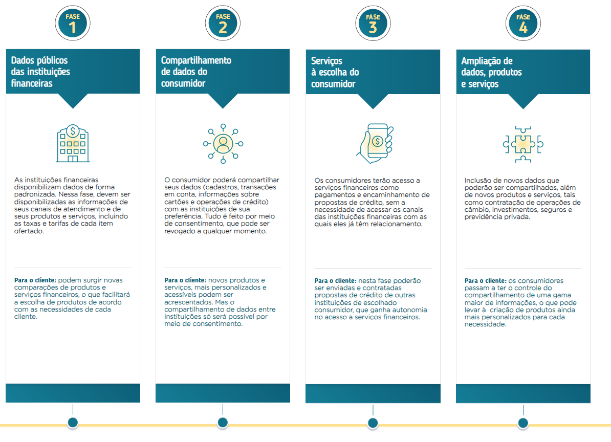
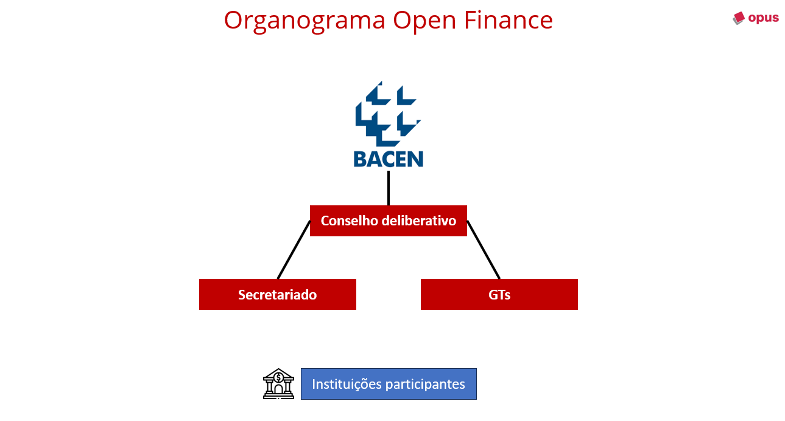

## The Ecosystem

Open Finance Brasil plays a significant role in the transformation of the country’s payment system. Just as Pix was a success, Open Finance has various benefits for the entire Brazilian population, especially in the medium and long term. For the Central Bank, the purpose of Open Finance is to foster a more competitive environment in the financial system, improving service quality, promoting innovation, and increasing competition for customers, which naturally leads to a reduction in rates and costs by the market.

To learn more, [visit the website](https://openfinancebrasil.org.br/conheca-o-open-finance/) and watch the available videos.

---

## Scope of Open Finance

Open Finance has a scope of implementation in 4 different phases, known as:

1. **Phase 1 - Open Data**
2. **Phase 2 - Customer Data**
3. **Phase 3 - Services**
4. **Phase 4 - Complement to Phases 1 and 3**

Each phase is described in detail in the image below:

[Source: Central Bank](https://openfinancebrasil.org.br/conheca-o-open-finance/)

---

## Open Finance Structure

To ensure the implementation of Open Finance, the Central Bank has defined a structure to achieve the ecosystem’s objectives. The structure is divided as follows:

### Central Bank

It is responsible for defining the strategic guidelines for Open Finance and maintains direct contact with the Deliberative Council to analyze the progress of activities. The main channel for publishing new guidelines and requirements is through the issuance of normative instructions.

[Consult the Central Bank's regulatory repository](https://www.bcb.gov.br/estabilidadefinanceira/buscanormas).

---

### Deliberative Council

It decides on the strategic issues necessary for the implementation of the project in Brazil and proposes technical standards to the [Central Bank](https://www.bcb.gov.br/).

---

### Secretariat

Acts as the main link with the Deliberative Council, providing information on the project's progress through reports, monitoring technical and regulatory timelines, managing suppliers, and organizing working groups (GTs).

---

### Working Groups (GTs)

They are responsible for studies, technical proposals, and plans focused on the implementation and management of Open Finance. They include professionals from technology companies and academics. Currently, there are eight GTs:

1. **GT Specifications**: Defines data scope and interfaces for products and services.
2. **GT Customer Experience**: Develops the [User Experience Guide](https://openfinancebrasil.atlassian.net/wiki/spaces/OF/pages/17378535/Guia+de+Experi+ncia+do+Usu+rio).
3. **GT Infrastructure**: Manages the ecosystem's platforms and tools.
4. **GT Policy, Risks, and Compliance**: Regulatory and compliance analyses.
5. **GT Definitive Structure**: Defines the legal nature and function of the structure.
6. **GT Security**: Defines authentication and authorization standards and protocols.
7. **GT Communication**: Manages information and informative content.
8. **GT Architecture**: Ensures integration between GTs and continuity strategies.

There are also 6 internal GTs for additional support to the received demands.

---

### Participating Institutions

Participating institutions must monitor the progress of the ecosystem to ensure compliance with regulatory requirements. It is essential to follow the main information channels.

---

## Relevant Links for the Regulatory

- [Informas](https://openfinancebrasil.atlassian.net/wiki/spaces/OF/pages/17367115/Reposit+rio+de+Informes)
- [Developer Portal](https://openfinancebrasil.atlassian.net/wiki/spaces/OF/overview)
- [Bacen Normative Instructions](https://www.bcb.gov.br/estabilidadefinanceira/buscanormas)
- [Deliberative Council Decisions Repository](https://openfinancebrasil.org.br/decisoes-do-conselho-deliberativo/)
- [Open Finance YouTube Channel](https://www.youtube.com/@openfinancebrasil/videos)
- [Annual Reports](https://openfinancebrasil.org.br/relatorios/)
