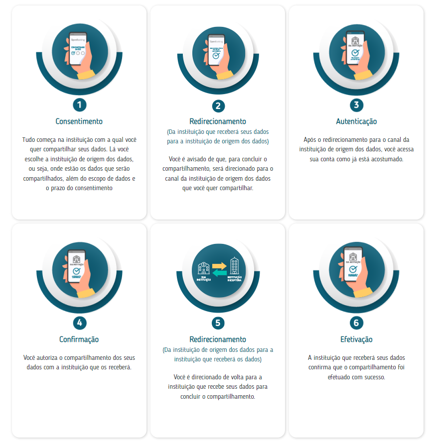
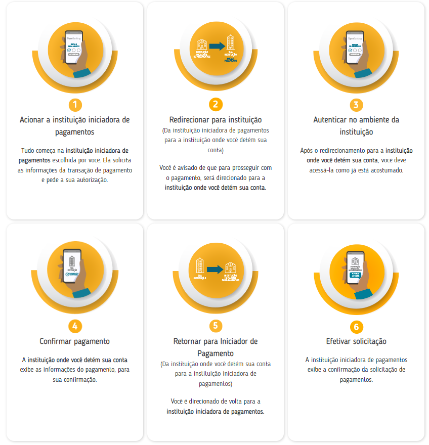

## Consent Journey

In Open Finance, any operation can only be performed—whether it is data sharing or making a payment—if there is consent approved by the user (client of a financial institution) who initiated the journey. Therefore, it is always necessary to perform a *consent journey* for the user to authorize the operation.

**Consent** is the term used to demonstrate that the user, a client of the financial institution, agrees with the operation that the **Payment Initiator** or the **Data Receiver** is requesting from the **Account Holder** or the **Data Transmitter**.

---

## Consent Journey for Data Sharing

  
Source: Central Bank

1. The user accesses the **Data Receiver's** environment and requests the initiation of a new data sharing via Open Finance.
2. After making the request and choosing the **Data Transmitter**, the user is automatically redirected to the Transmitter's environment.
3. In the Transmitter's environment, the user authenticates using biometrics or registered credentials to access their account.
4. After logging in, the user selects and confirms the data they wish to share.
5. Finally, the user is redirected back to the Data Receiver's environment, where they receive confirmation that the sharing was successful.

---

## Consent Journey for Payments

  
Source: Central Bank

1. The user accesses the **Payment Initiator (ITP)** environment and requests the initiation of a new payment via Open Finance.
2. After making the request and choosing the **Account Holder**, the user is automatically redirected to the Account Holder's environment.
3. In the Account Holder's environment, the user authenticates using biometrics or registered credentials to access their account.
4. After logging in, the user confirms the payment by verifying the transaction details and entering their credentials.
5. The user is redirected back to the ITP environment, where they receive confirmation that the payment was successfully made.

For more details on possible consent statuses and the payment state machine, please refer to the [developer portal](https://openfinancebrasil.atlassian.net/wiki/spaces/OF/pages/347078805/M+quina+de+Estados+-+v4.0.0+-+SV+Pagamentos).

---

## Differences Between Consent Journeys

Although similar, the journeys have particularities due to their distinct purposes:

| **Aspect**                | **Data**                                                                                     | **Payments**                                                                        |
|---------------------------|----------------------------------------------------------------------------------------------|-------------------------------------------------------------------------------------|
| **Consent Duration**       | Defined by the user during the journey, ranging from 1 to 12 months or indefinite time.     | Consent is used once, consumed immediately after the payment.                        |
| **Payment Amount**         | Does not apply.                                                                               | Defined by the ITP and displayed to the user during consent confirmation.            |
| **Variations in Consent**  | Depends on the information of the products the user wants to share ([see possible products here](../PerfisOFB/OOF-Transmissor.html)). | Depends on the type of payment selected [(check the roadmap here)](../PerfisOFB/OFB-Detentor.html). |

For more information on the user experience journey defined by the regulator, [click here](https://openfinancebrasil.atlassian.net/wiki/spaces/OF/pages/17378535/Guia+de+Experi+ncia+do+Usu+rio).
