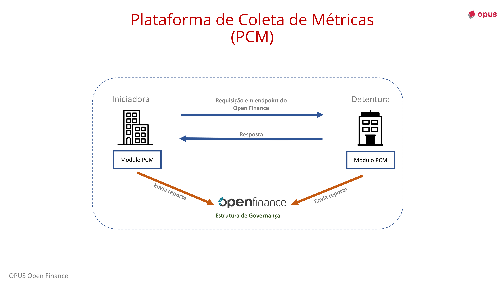

## Introduction

The **Metrics Collection Platform (MCP)** is a mandatory regulatory requirement in the Open Finance ecosystem. All participating institutions must report to the governance structure metrics related to all API calls made and/or received.

### Information to be sent

- **Endpoint accessed**
- **Date and time of the event**
- **Result received**
- **Response time**

Both institutions involved in any operation must send this information to the MCP.

---

## Opus Open Finance Solution

The Opus Open Finance Platform has a module that runs as an independent service, managing the entire process of collecting and sending the calls to the MCP, ensuring regulatory compliance without the need for you to worry about it.

## More Information

For more details about the Metrics Collection Platform, [click here](https://openfinancebrasil.atlassian.net/wiki/spaces/OF/pages/37945356/Especifica+o+T+cnica).
