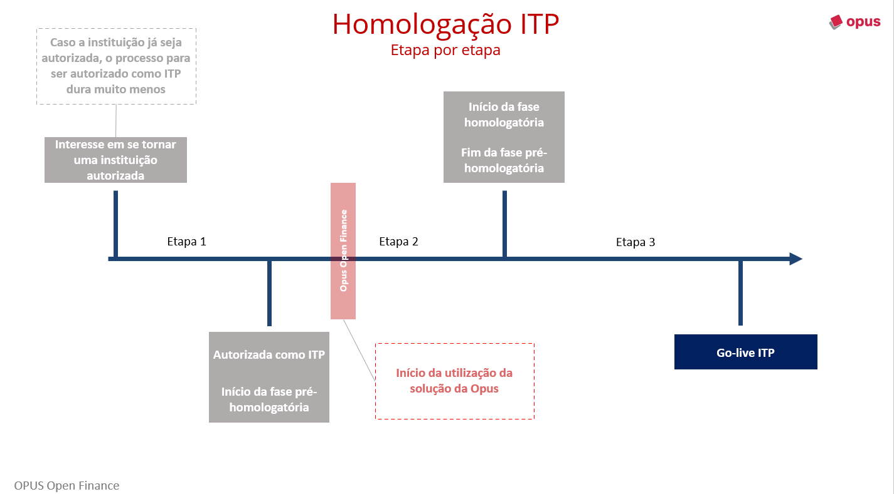
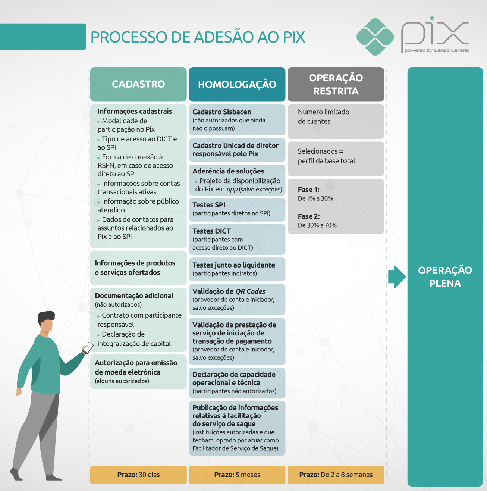

## Payment Transaction Initiator (ITP) Onboarding Process

### Introduction

To become an institution eligible to perform **Payment Transaction Initiations (ITP)**, it is necessary to meet a series of prerequisites and requirements organized into 3 major stages:

1. **Authorization and Regulation with the Central Bank**
2. **Pre-qualification Stage of Open Finance**
3. **Qualification Stage of Open Finance**

Upon completion of these stages, the institution will be eligible to perform live payments.

---

### Overview of Becoming an ITP

| **Stage**                     | **Description**                                                                                     | **Systems Involved**            | **Notes**                                                                                                                                                                |
|-------------------------------|-----------------------------------------------------------------------------------------------------|---------------------------------|-----------------------------------------------------------------------------------------------------------------------------------------------------------------------|
| **1 - Authorization and Regulation** | Compliance and legal procedures                                                                         | Central Bank                    | The institution must be authorized by the Central Bank to operate as a Payment Institution.                                                                            |
| **2 - Pre-qualification**      | Fulfill prerequisites related to Pix and Open Finance.                                               | Pix and Open Finance             | Includes certifications, publications on the Citizen Portal, and Pix participant PDF.                                                                                  |
| **3 - Qualification**          | Open Finance onboarding process for final validation.                                                 | Open Finance                    | Perform tests in production and meet the minimum approval requirements for operation in the ecosystem.                                                                |

---

### Detailed Breakdown of the Stages

#### **Stage 1 - Authorization and Regulation**

The purpose of this documentation is not to go into detail on how to obtain authorization from the Central Bank, which is extremely complex. Therefore, we will focus on the business rules for this stage. If you or your institution are interested in becoming authorized, we can refer you to legal partners who specialize in this area.

Currently, the Central Bank has included the Payment Transaction Initiator (ITP) modality as a Payment Institution. As the name suggests, it is a modality entirely linked to Open Finance. In this context, there are two types of ITPs within this ecosystem: those authorized by the Central Bank and those that already have authorization from Open Finance governance to begin payment initiation activities.

> An ITP authorized by the Central Bank cannot yet initiate payment initiation calls. It still needs to complete stages 2 and 3.

In general, ITP authorization is aimed at institutions seeking simplified regulation, but other types of institutions already authorized find it easier to become an ITP.

> For the authorization process, it is essential that your compliance department is involved.

#### **Stage 2 - Pre-qualification**

##### Prerequisites

Once the institution is authorized to operate as an ITP, it must meet the prerequisites that precede the qualification stage in Open Finance. The prerequisites are divided into 4:

1. [**OpenID RP Certification**](../OFB-Certificações.html):
   - Must be published on the [official OpenID website](https://openid.net/certification/#FAPI_RPs).
   - Opus can assist in completing the process in just a few weeks.

2. **Publication on the Citizen Portal**:
   The Citizen Portal lists all institutions eligible in the Open Finance participation modality. To initiate the qualification process, the institution must be listed on this portal as a payment initiation service provider.
   To publish the institution, the configuration in the participant directory (in both testing and production environments) must be completed. This will automatically list the institution in this category.

   > During the product implementation, Opus handles the entire directory configuration process so you don’t have to worry about it.

3. **Payment API Certification and Publication** (if the institution is also an Account Holder):
    If the institution also participates in Open Finance as an Account Holder, it must comply with all regulations for this profile before starting the ITP qualification process. The Account Holder profile requires the publication of the [OpenID OP certification](../OFB-Certificações.html) and proper publication of its APIs.

4. **Publication in the Pix Participant PDF**:
    This prerequisite is critical, as it is the longest and is linked to the Pix arrangement. [Pix PDF](https://www.bcb.gov.br/estabilidadefinanceira/participantespix) (access on the right) is a list of all Pix participants, and to be qualified as an ITP, your institution must be listed in the "Payment Transaction Initiation" column.
    To do this, your institution needs to express interest to the Central Bank through a Pix adoption form. [The process is described on the Central Bank's official page](https://www.bcb.gov.br/estabilidadefinanceira/participantespix). The table summarizes the main forms.
    The process is divided into three stages for registration within the Pix arrangement:

##### **Stage 1 _PIX_- Registration**

Consists of sending the necessary documents to register the institution in the Pix arrangement:

| **Institution Type**              | **Form 1**  | **Form 2**  | **Form 3** |
|-----------------------------------|-------------|-------------|------------|
| **Initiator without access to DICT** | [#1](https://www.bcb.gov.br/content/estabilidadefinanceira/pix/Formulario_adesao-Iniciadores.docx) | [#2](https://www.bcb.gov.br/content/estabilidadefinanceira/pix/Formulario_produtos_e_servicos-Iniciador.docx) | [#3](https://www.bcb.gov.br/content/estabilidadefinanceira/pix/Adesao_Questionarios/Questionario_autoavaliacao_seguranca-Iniciador-Sem_acesso_DICT.docx) |
| **Initiator with indirect access to DICT** | [#1](https://www.bcb.gov.br/content/estabilidadefinanceira/pix/Formulario_adesao-Iniciadores.docx) | [#2](https://www.bcb.gov.br/content/estabilidadefinanceira/pix/Formulario_produtos_e_servicos-Iniciador.docx) | [#3](https://www.bcb.gov.br/content/estabilidadefinanceira/pix/Adesao_Questionarios/Questionario_autoavaliacao_seguranca-Iniciador-Com_Acesso_indireto_DICT.docx) |
| **Initiator with direct access to DICT** | [#1](https://www.bcb.gov.br/content/estabilidadefinanceira/pix/Formulario_adesao-Iniciadores.docx) | [#2](https://www.bcb.gov.br/content/estabilidadefinanceira/pix/Formulario_produtos_e_servicos-Iniciador.docx) | [#3](https://www.bcb.gov.br/content/estabilidadefinanceira/pix/Adesao_Questionarios/Questionario_autoavaliacao_seguranca-Iniciador-Com_Acesso_direto_DICT.docx) |

- **Submission:** Forms must be sent to **<pix-operacional@bcb.gov.br>**.
- **Signature:** The documents must be signed by a statutory representative of the institution.

---

##### **Stage 2 _PIX_- Qualification**

This stage refers to the tests that must be performed to be included as a Pix participant. This stage includes several tests, but only those directed at the Payment Transaction Initiator are mandatory for the institution.

The mandatory test is the Validation of the Payment Initiation Service. In addition, there are two other tests if your institution offers QR Codes or has access to DICT, these are the QR Code Validation and DICT Tests, respectively.

##### **Stage 3 _PIX_- Restricted Operation Stage**

For the Initiator, no restricted operation is required. Once the registration and qualification stages are completed, your institution will be listed as a Pix participant.

---

#### **Stage 3 - ITP Onboarding**

Finally, we reach the stage fully related to the Open Finance ecosystem, known as ITP Onboarding. This stage is well described within the developer portal with the [ITP onboarding guide](https://openfinancebrasil.atlassian.net/wiki/spaces/OF/pages/17378706/Guia+de+Onboarding+ITP).

In short, the new Initiator will need to perform 6 live payments and obtain 4 successes out of these 6. This is enough for the institution to begin its live operations. From the 6 tests, your institution can choose which 6 Account Holders to make payments with.

> Opus can recommend the 6 Account Holders.

At the end of the process, an [Informa](https://mailchi.mp/afc5cfe5cc93/open-banking-informa-10116651?e=447d7abb9f) will be released confirming that the process has been completed and that your institution is ready to begin live payments.

> Throughout stage 3, Opus will be side by side with your institution to facilitate and expedite the qualification process.

Opus will assist the institution throughout the qualification stage, speeding up the process and providing technical support.

---

### Access to DICT

Access to DICT is not mandatory, but it limits the types of payment initiation allowed. Without access, only **Pix Manu** is feasible, where the institution already has the account number and agency information of the account holder.

#### **Types of Pix Payment Initiation**

| **Type**       | **Description**                                                                 | **DICT Access Required?** |
|----------------|:-------------------------------------------------------------------------------:|:--------------------------:|
| **Manu**       | Manual entry of transactional account data.                                    | No                        |
| **DICT**       | Manual entry of Pix key.                                                       | Yes                       |
| **QRDN**       | Dynamic QR Code.                                                               | Yes                       |
| **QRES**       | Static QR Code.                                                                | Yes                       |
| **INIC**       | Beneficiary previously known by the Initiator.                                  | No                        |

If your institution wishes to have access to DICT, Opus can recommend suppliers offering **DICT-as-a-Service**.
