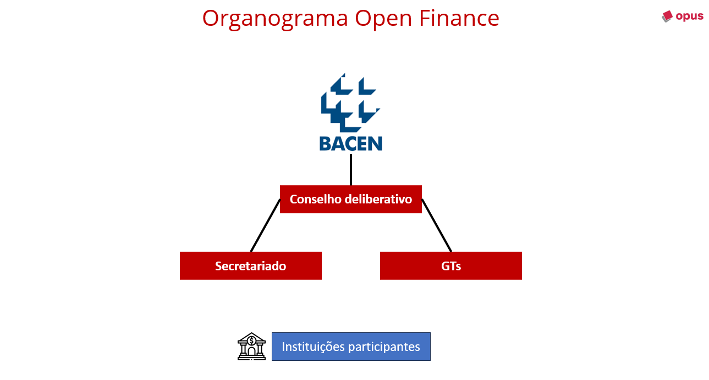

## O Ecossistema

O Open Finance Brasil carrega um peso significativo na transformação do sistema de pagamentos do país. Assim como o Pix foi um sucesso, o Open Finance possui diversos benefícios para toda a população brasileira, especialmente a médio e longo prazo. Para o Banco Central, o propósito do Open Finance é incentivar um ambiente de maior competição no sistema financeiro, melhorando os qualidade dos serviços, promovendo inovação e proporcionando maior disputa pelos clientes, tendendo à natural redução das taxas e custos pelo mercado.

Para saber mais, [acesse o site](https://openfinancebrasil.org.br/conheca-o-open-finance/) e assista aos vídeos disponibilizados.

---

## Escopo do Open Finance

O Open Finance tem um escopo de implementação em 4 diferentes fases, conhecidas como:

1. **Fase 1 - Dados Abertos**
2. **Fase 2 - Dados do Cliente**
3. **Fase 3 - Serviços**
4. **Fase 4 - Complemento às Fases 1 e 3**

Cada fase é descrita em detalhes na imagem abaixo:

[Fonte: Banco Central](https://openfinancebrasil.org.br/conheca-o-open-finance/)

---

## Estrutura do Open Finance

Para garantir a implementação do Open Finance, o Banco Central definiu uma estrutura para concretizar os objetivos do ecossistema. A estrutura está dividida da seguinte forma:

### Banco Central

É responsável pela definição das diretrizes estratégicas do Open Finance e mantém contato direto com o Conselho Deliberativo para analisar o andamento das atividades. O principal canal para divulgação de novas diretrizes e requisitos é através da publicação de instruções normativas.

[Consulte o repositório de normativos do Banco Central](https://www.bcb.gov.br/estabilidadefinanceira/buscanormas).

---

### Conselho Deliberativo

Decide as questões estratégicas necessárias para a implementação do projeto no Brasil e propõe os padrões técnicos ao [Banco Central](https://www.bcb.gov.br/).

---

### Secretariado

Atua como elo principal com o Conselho Deliberativo, informando sobre o andamento do projeto por meio de relatórios, acompanhamento de cronogramas técnicos e regulatórios, gestão de fornecedores e organização dos grupos de trabalho (GTs).

---

### Grupos de Trabalho (GTs)

São responsáveis por estudos, propostas técnicas e planos voltados para a implementação e gestão do Open Finance. Incluem profissionais de empresas de tecnologia e acadêmicos. Atualmente, existem oito GTs:

1. **GT Especificações**: Define escopo de dados e interfaces para produtos e serviços.
2. **GT Experiência do Cliente**: Desenvolve o Guia de [Experiência do Usuário](https://openfinancebrasil.atlassian.net/wiki/spaces/OF/pages/17378535/Guia+de+Experi+ncia+do+Usu+rio).
3. **GT Infraestrutura**: Gestão de plataformas e ferramentas do ecossistema.
4. **GT Política, Riscos e Compliance**: Análises regulatórias e de conformidade.
5. **GT Estrutura Definitiva**: Define natureza jurídica e função da estrutura.
6. **GT Segurança**: Define padrões e protocolos de autenticação e autorização.
7. **GT Comunicação**: Gerencia informações e conteúdos informativos.
8. **GT Arquitetura**: Garante integração entre os GTs e estratégias de continuidade.

Há também 6 GTs internos para suporte adicional às demandas recebidas.

---

### Instituições Participantes

As instituições participantes devem acompanhar o andamento do ecossistema para garantir conformidade com os requisitos regulatórios. É essencial monitorar os principais canais de informação.

---

## Links Relevantes para o Regulatório

- [Informas](https://openfinancebrasil.atlassian.net/wiki/spaces/OF/pages/17367115/Reposit+rio+de+Informes)
- [Portal do desenvolvedor](https://openfinancebrasil.atlassian.net/wiki/spaces/OF/overview)
- [Instruções normativas do Bacen](https://www.bcb.gov.br/estabilidadefinanceira/buscanormas)
- [Repositório de decisões do Conselho Deliberativo](https://openfinancebrasil.org.br/decisoes-do-conselho-deliberativo/)
- [Canal do Open Finance no YouTube](https://www.youtube.com/@openfinancebrasil/videos)
- [Relatórios anuais](https://openfinancebrasil.org.br/relatorios/)
