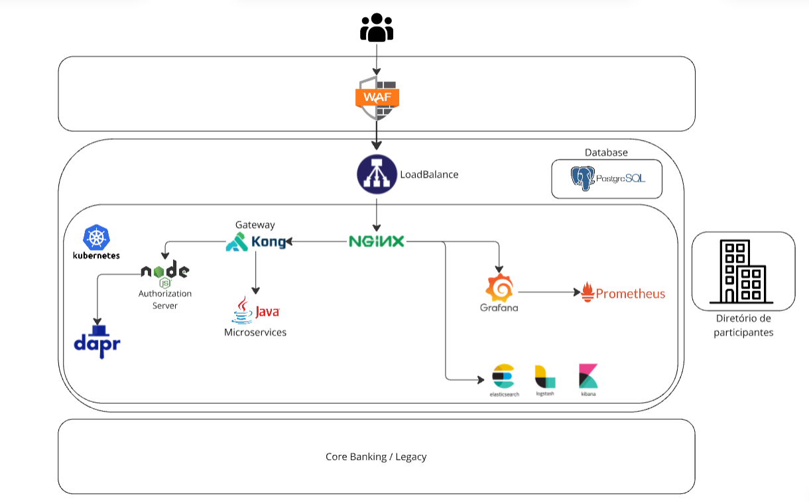

## Infraestrutura Core do Opus Open Finance

Este documento tem como objetivo orientar a replicação de nossa infraestrutura de Open Finance nos ambientes dos clientes. Ele contém os comandos e instruções técnicas necessários para garantir uma integração eficiente e segura. Abaixo, fornecemos uma visão geral do Open Finance Brasil e das tecnologias que utilizamos para oferecer resiliência, escalabilidade e segurança.

---

## Introdução ao Open Finance Brasil
O Open Finance Brasil é um sistema regulado que permite o compartilhamento seguro de dados financeiros entre instituições autorizadas, com o consentimento do usuário. Seu objetivo é promover maior competitividade, inclusão financeira e inovação por meio da interoperabilidade dos sistemas financeiros. Nossa infraestrutura foi projetada para atender aos requisitos desse ecossistema, garantindo segurança e confiabilidade no tratamento de dados.

---

## Diagrama da Arquitetura do Opus Open Finance



---

## Requisitos
Para utilizar o Opus Open Finance, os seguintes requisitos devem ser atendidos:

1. **Cluster Kubernetes**:
   - Configurado com uma Storage Class para discos usados por componentes que persistem dados.
   - Suporte a versões do Kubernetes até **1.30**.

2. **Banco de Dados PostgreSQL**:
   - Versões recomendadas: >= 14.

3. **Ferramentas na Máquina de Acesso**:
   - **kubectl** (Instruções de instalação disponíveis no [link](https://kubernetes.io/docs/tasks/tools/install-kubectl-linux/))
   - **terraform** v1.8.x (Instruções de instalação disponíveis no [link](https://developer.hashicorp.com/terraform/install#linux))
   - **terragrunt** v.0.43.x (Instruções de instalação disponíveis no [link](https://terragrunt.gruntwork.io/docs/getting-started/install/))
   - **age** v1.x.x (Instruções de instalação disponíveis no [link](https://github.com/FiloSottile/age?tab=readme-ov-file#installation))
   - **sops** v3.x.x (Instruções de instalação disponíveis no [link](https://github.com/getsops/sops?tab=readme-ov-file#1download))

4. **Serviço de Mensageria**:
   - Necessário para comunicação entre serviços distribuídos.

5. **Coletores de Logs**:
   - Para armazenamento dos logs gerados pelo produto.

6. **Acesso à Internet**:
   - Requisito regulatório.

---

## Sobre o Terragrunt
Toda a infraestrutura da plataforma Opus Open Finance é construída utilizando scripts Terraform. Para facilitar o gerenciamento de infraestrutura como código, utilizamos o **Terragrunt**, uma ferramenta que fornece uma camada de abstração para simplificar tarefas comuns do Terraform, como gerenciamento de configurações, dependências e ambientes. Isso torna o processo de implementação e manutenção mais fácil para os usuários.

Algumas das principais funcionalidades do Terragrunt incluem seu **modelo hierárquico**, onde configurações são herdadas de arquivos "pai" usando o bloco `include`. Para entender melhor essa funcionalidade, recomenda-se a leitura do artigo fornecido pela equipe do Terragrunt: [link](https://terragrunt.gruntwork.io/docs/features/keep-your-terragrunt-architecture-dry/).

A estrutura é dividida em dois componentes principais: **Core** e **Client**, descritos em detalhes na seção **Hierarquia**.

---

## Compatibilidade com Microsserviços e Containers
Nossos microsserviços são empacotados e executados em containers, garantindo portabilidade e consistência entre os ambientes. A infraestrutura suporta múltiplas plataformas de orquestração baseadas em Kubernetes e é compatível com versões do Kubernetes até **1.30**, permitindo flexibilidade para ambientes on-premise ou em nuvem.

---

## Hierarquia
A hierarquia do código é essencial para garantir modularidade e reutilização. O Terragrunt permite a separação em duas partes: **Core** e **Client**:

### Core
- **Módulos Terraform**: Contém o código Terraform para os componentes.
- **Templates Terragrunt**: Arquivos Terragrunt usados como "templates". Estes definem grande parte da "inteligência" do código, incluindo variáveis padrão para cada contexto e a lógica de dependência entre componentes. Sempre que quiser entender como uma variável é configurada, este é o primeiro lugar a verificar.
- **Scripts**: Scripts auxiliares, como os que lidam com a lógica de criptografia e descriptografia dos arquivos `secrets.tfvars.encrypted`.
- **secrets.hcl**: Contém os hooks para descriptografar os arquivos `secrets.tfvars.encrypted` durante o runtime.
- **opus.hcl**: Contém configurações específicas do Opus usadas por determinados componentes, como o endereço do repositório de imagens do produto.

### Client
- **client.hcl**: Configurações globais para todos os ambientes, como informações da organização e da marca.
- **env.hcl**: Configurações específicas do ambiente, definindo versões a serem usadas (tanto para aplicações quanto para o core), informações do diretório de participantes do Open Banking, endereços de banco de dados, modificações de URL, entre outros.
- **namespace.hcl**: Configurações específicas do namespace no cluster Kubernetes.
- **Componente**: Um "componente" é qualquer diretório contendo um arquivo `terragrunt.hcl`. É aqui que a utilidade do Terragrunt deve ser executada, pois seus includes aplicam toda a hierarquia.

---

## Download Automático do Core
Antes de executar cada componente, o script `opus_get_core.sh` é executado. Este script é responsável por clonar automaticamente o repositório Core caso ele ainda não exista.

O script determina a versão do Core a ser usada referenciando o arquivo `env.hcl` apropriado. Para identificar corretamente o ambiente, o nome do diretório do ambiente deve corresponder ao regex `env_path` especificado no script.

Para bases de código de exemplo (onde a versão do Core é definida como `example`), o Core não é clonado. Em vez disso, é usada uma referência ao repositório local.

---

## Secrets
Todas as configurações sensíveis são armazenadas em um arquivo criptografado chamado `secrets.encrypted.tfvars`. Este arquivo é descriptografado e lido pelo Terragrunt durante o runtime. Ele permite definir variáveis, bem como valores do Helm, usando a variável `values_sensitive_custom`, que funciona da mesma forma que a variável `values_custom` explicada anteriormente.

### Editando o Arquivo Criptografado
O arquivo criptografado só pode ser editado usando o **sops**. Antes de editar, a chave privada do cluster deve ser salva localmente executando o seguinte comando:

```shell
export SOPS_AGE_KEY_FILE="$HOME/.config/sops/age/keys.txt" && \
$(find $(git rev-parse --show-toplevel) -name 'save_keys.sh' | head -n1)
```

sops `secrets.encrypted.tfvars`: When the file is saved, **sops** automatically re-encrypts it.

---

## Rotação de Chaves de Criptografia
**ATENÇÃO**: Os passos a seguir apenas rotacionam o par de chaves usado para criptografar os arquivos `secrets.encrypted.tfvars`. Eles não alteram o conteúdo desses arquivos (por exemplo, as chaves de acesso ao banco de dados permanecem inalteradas).

**ATENÇÃO**: É fundamental que a máquina que realiza essa rotação tenha acesso ao repositório Git onde o código do Client está armazenado. Isso porque todos os arquivos devem ser recriptografados e comitados no repositório durante esse processo.

### Passos:
1. **Remova o arquivo local contendo as chaves:**

```shell
rm $HOME/.config/sops/age/keys.txt
```

2. **Aplique o código para rotacionar as chaves (gera um novo par e recriptografa todos os arquivos):**

```shell
terragrunt apply -auto-approve \
--terragrunt-working-dir '06-helm/00-oob-encrypt/01-secret-keys' \
--terragrunt-config '06-helm/00-oob-encrypt/01-secret-keys/terragrunt.rotate_keys.hcl'
```

3. **Atualize os arquivos criptografados no repositório remoto:**

```shell
git add '*secret.encrypted.tfvars' && git commit -m "Encryption keys rotation" && git push
```

4. **Faça backup das novas chaves (salve-as remotamente em um local seguro):**

```shell
$(find $(git rev-parse --show-toplevel) -name 'get_keys.sh' | head -n1)
```

>**Dica**: O script `get_keys.sh` retorna um JSON, o que simplifica a automação do passo 4.


## Banco de Dados: PostgreSQL
Utilizamos o PostgreSQL como banco de dados padrão, recomendando a versão 14 ou superior. Este banco é ideal para o ecossistema Open Finance devido à sua robustez e escalabilidade. Caso um provedor de nuvem seja utilizado, recomendamos aproveitar um serviço gerenciado de banco de dados.

Nossos templates incluem scripts para criação de instâncias, usuários e bancos de dados, que podem ser personalizados conforme necessário. Para acessar o banco de dados, a configuração de secrets deve ser atualizada no arquivo `secrets.encrypted.tfvars`.

---

## Serviço de Mensageria
Para garantir a comunicação entre nossos serviços distribuídos, utilizamos filas de mensagens como parte essencial da infraestrutura. Essas filas permitem processamento assíncrono e desacoplamento entre microsserviços, aumentando a escalabilidade e resiliência do sistema. Tecnologias como Apache Kafka, RabbitMQ ou AWS SQS podem ser utilizadas, dependendo do ambiente e requisitos do cliente.

---

## Coletores de Logs
Qualquer solução de coleta de logs disponível no mercado pode ser utilizada no ambiente de infraestrutura, desde que seja compatível com as tecnologias empregadas. Isso inclui, mas não se limita a, soluções como ELK Stack (Elasticsearch, Logstash, Kibana), Fluentd, Prometheus, Grafana Loki, Splunk, entre outras.

A ferramenta ideal deve ser escolhida com base nas necessidades específicas do cliente em relação ao monitoramento, análise de desempenho e rastreamento de eventos. Os coletores de logs devem ser configurados para garantir a captura eficiente de dados e manter a integridade das informações ao longo do tempo. A OPUS fornece orientações para a integração desses sistemas, mas a responsabilidade pela manutenção e gerenciamento dos logs é do cliente.

---

## WAF (Web Application Firewall)
O Web Application Firewall (WAF) é uma camada crítica de segurança para proteger aplicações web contra ataques e vulnerabilidades comuns, como injeção de SQL, cross-site scripting (XSS) e outras ameaças.

Recomendamos que os clientes configurem o WAF de acordo com as melhores práticas de segurança para garantir uma integração eficaz com o ambiente de produção. O Open Finance, que envolve a troca segura de dados financeiros entre instituições, exige altos padrões de segurança, incluindo o uso de mTLS, uma prática que o WAF deve suportar. A OPUS oferece orientações para quaisquer dúvidas, mas a gestão contínua, implementação, configuração e manutenção do WAF são de responsabilidade do cliente.

---

## Dapr
A arquitetura de microsserviços é complementada pelo uso do **Dapr** (Distributed Application Runtime), que simplifica a comunicação e o gerenciamento de estado entre serviços. Com o Dapr, garantimos a interoperabilidade de nossas aplicações distribuídas de forma eficiente e segura.

---

## Customizações
A instalação dos componentes do Opus Open Banking é realizada via **Helm**. Os valores do Helm para cada componente podem ser personalizados usando a variável `values_custom` no lado do Client.

Essa variável é análoga à variável `values_template` no template. Caso haja dúvidas, recomenda-se consultar o template. Essencialmente, trata-se de um YAML indentado em formato heredoc, interpretado pelo módulo Terraform como um arquivo YAML.

### Nota Importante:
É crucial não definir a variável `values_template` dentro do componente (no campo `inputs` do arquivo `terragrunt.hcl`). Essa variável é exclusivamente para uso no template. Defini-la no nível do componente sobrescreverá o template e causará mau funcionamento no código. Sempre utilize a variável `values_custom` em vez disso.

### Exemplo:
```shell
# terragrunt.hcl
inputs = {
  values_custom = <<-YAML
  # The dash before YAML indicates this is an indented heredoc
  #---------------#
  # VALUES CUSTOM #
  #---------------#

  # Here is a normal YAML code, as it would appear in a .yaml file
  # The advantage is that ${} interpolations can be used to call Terragrunt functions/configurations

  foo:
    bar:
      demo: "somestring"
      test:
        user: "usuario-${local.client_vars.client}-${local.env_vars.environment}"
  YAML
}
```

---

## Execução
Para simplificar a execução dos componentes, fornecemos o script `apply-all.sh`, que aplica todas as configurações necessárias na ordem correta. É essencial seguir as instruções do script para evitar erros de configuração.

---

## Notas Importantes
Algumas considerações importantes ao trabalhar com um ambiente de staging/produção:

### Banco de Dados:
- A aplicação requer o uso do componente **postgresql**, mas recomenda-se criar um banco de dados separado do cluster. Caso um provedor de nuvem seja utilizado, aconselhamos optar por um serviço gerenciado de banco de dados. O template para este componente inclui as consultas necessárias para criar os bancos de dados e os usuários exigidos pelo produto.
- Após a criação da instância, o host deve ser configurado no campo `db_host` do arquivo `env.hcl`. Além disso, os arquivos `secrets.encrypted.tfvars` dos componentes que se conectam ao banco de dados devem ser atualizados com a senha do respectivo usuário.
- Por exemplo, no arquivo `secrets.encrypted.tfvars` do componente **oob-consent**, você deve substituir `changeThis` pela senha do usuário **oob_consent_user**, e assim por diante.

### Componente Cert-manager:
- Útil em ambientes de staging para gerar automaticamente certificados Let's Encrypt.
- Em produção, não é necessário, pois todos os certificados de produção devem ser obtidos de uma autoridade certificadora conforme as especificações regulatórias do ecossistema.