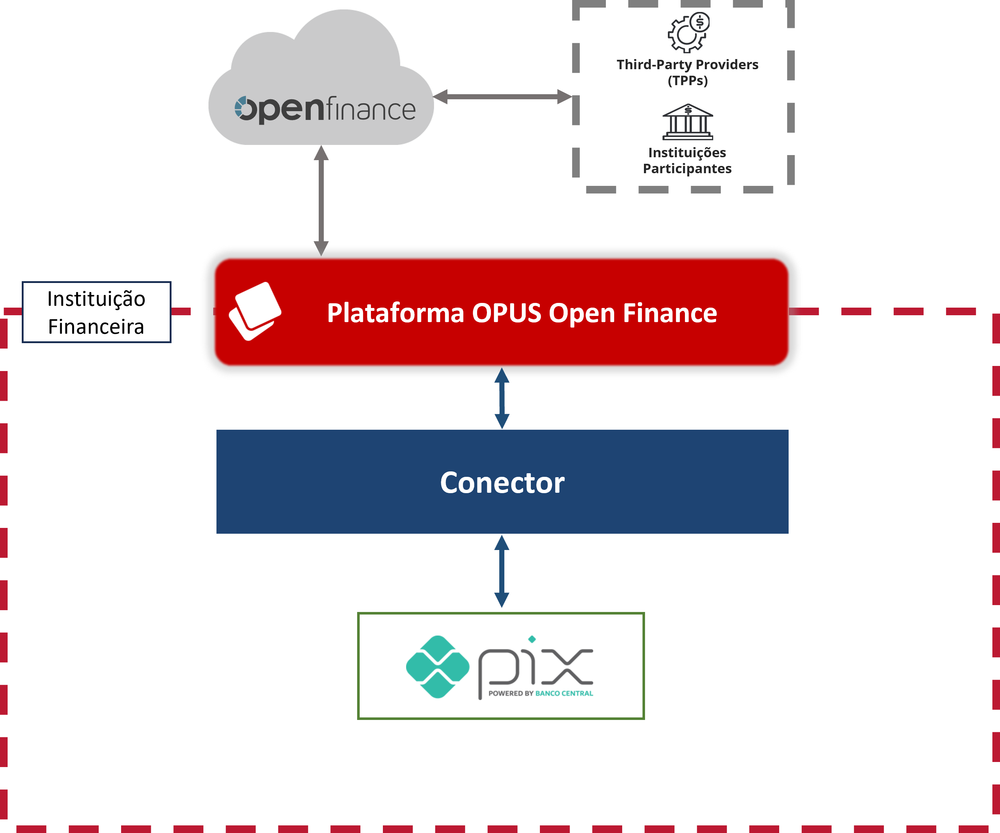

## Pagamentos

A integração com o pilar de pagamentos do _Open Finance Brasil_ é necessária apenas para o perfil de Detentor de Conta. Essa integração permite que o produto Opus direcione uma requisição para os sistemas de retaguarda necessários para o fluxo do pagamento. O fluxo de pagamento, em alto nível, se divide em dois, o **consentimento** e a **liquidação do pagamento** e ambos tem suas integrações necessárias. A integração com o produto funciona através de uma camada que chamamos de _conectores_. 

## Integração

A imagem abaixo esquematiza como o funcionamento do conector. Quando uma instituição participante do *Open Finance Brasil* envia uma requisição de pagamento, a **Plataforma Opus Open Finance** a recebe e realiza todas as validações necessárias, incluindo a verificação do consentimento associado ao pagamento. Uma vez que a requisição seja considerada válida, a plataforma realizará uma chamada ao conector para efetivar o pagamento (no exemplo, acionando o serviço Pix da instituição). 

---

## Camada dos conectores

Tipicamente, um Conector é uma rota definida no [Apache Camel](xxx) que conecta um endpoint do sistema de retaguarda da instituição financeira à plataforma, realizando o pagamento associado à requisição recebida.

 Além disso, os conectores podem fazer pequenas transformações nos dados passados para respeitar formatos tanto do plataforma da Opus quanto do sistema de retaguarda acionado. Por fim, os conectores podem fazer as mudanças necessárias, omitindo ou adicionando campos das requisições e repostas, para que ambas estejam de acordo com aquilo esperado em ambos os lados da comunicação.

Para pagamentos, existem atualmente rotas para: criar a iniciação do pagamento (POST) depois de já terem o consentimento, recuperar iniciações de pagamentos (GET) já realizadas, cancelar a iniciação de pagamento (PATCH), descobrir e listar contas e validar pagamentos.

Lembrando que esse pagamento será apenas iniciado pelo plataforma e cabe à instituição de fato realizar ou agendar o pagamento e retornar o resultado para o produto da Opus.

## Rotas dos conectores

A seguir, uma breve explicação de cada rota de integração do pagamento. Como o produto segue as especificações do _Open Finance Brasil_ em todas as fases, caso alguma dúvida surja, a palavra final será sempre da documentação oficial do regulatório. Especificamente para requisições de iniciação de pagamentos, pode-se referir a documentação de [Pagamentos V4](https://openfinancebrasil.atlassian.net/wiki/spaces/OF/pages/347079010/Informa+es+T+cnicas+-+SV+Pagamentos+-+v4.0.0) e de [Pagamentos Automáticos V1](https://openfinancebrasil.atlassian.net/wiki/spaces/OF/pages/345178397/Informa+es+T+cnicas+-+SV+Pagamentos+Autom+ticos+-+v2.0.0).

### Realizar um pagamento

A rota `POST pix payment` é a rota de iniciação de um pagamento Pix. É importante observar que, no Open Finance, o único meio de pagamento aceito hoje é o Pix. Esse conector é ativado durante a jornada do pagamento em si, isto é, o consentimento já foi autorizado.

Os schemas podem ser encontrados aqui:

|Schema                             | Link        |
|-----------------------------------|:-----------:|
|Request exemplo  |[link](./Schemas_conector_pgto/payment/paymentsPostPixPayments_v3/request-example.json)|
|Request pagamentos automáticos V2  |[link](./Schemas_conector_pgto/payment/paymentsPostPixPayments_v3/request-recurring-example-v2.json)|
|Request schema  |[link](./Schemas_conector_pgto/payment/paymentsPostPixPayments_v3/request-schema.json)|
|Response error exemplo  |[link](./Schemas_conector_pgto/payment/paymentsPostPixPayments_v3/response-error-example.json)|
|Response error schema  |[link](./Schemas_conector_pgto/payment/paymentsPostPixPayments_v3/response-error-schema.json)|
|Response exemplo  |[link](./Schemas_conector_pgto/payment/paymentsPostPixPayments_v3/response-example.json)|
|Response pagamentos automático exemplo  |[link](./Schemas_conector_pgto/payment/paymentsPostPixPayments_v3/response-recurring-example.json)|
|Response schema  |[link](./Schemas_conector_pgto/payment/paymentsPostPixPayments_v3/response-schema.json)|

### Cancelar um pagamento agendado

A rota `PATCH pix payment` realiza o cancelamento de um pix agendado. Segundo a regulação, participantes do Open Finance devem ter seus sistemas de pix agendado em produção. Esse concetor será chamada apenas se o usuário correntista utilizar a área de gestão do consentimento para cancelar um pagamento agendado, isto é, o consentimento já deve ter sido autorizado e o pagamento agendado.

Os schemas podem ser encontrados aqui:

|Schema                             | Link        |
|-----------------------------------|:-----------:|
|Request exemplo  |[link](./Schemas_conector_pgto/payment/paymentsPatchPixPaymentsPaymentId_v3/request-example.json)|
|Request pagamentos automáticos V2  |[link](./Schemas_conector_pgto/payment/paymentsPatchPixPaymentsPaymentId_v3/request-recurring-example-v2.json)|
|Request schema  |[link](./Schemas_conector_pgto/payment/paymentsPatchPixPaymentsPaymentId_v3/request-schema.json)|
|Response error exemplo  |[link](./Schemas_conector_pgto/payment/paymentsPatchPixPaymentsPaymentId_v3/response-error-example.json)|
|Response error schema  |[link](./Schemas_conector_pgto/payment/paymentsPatchPixPaymentsPaymentId_v3/response-error-schema.json)|
|Response exemplo  |[link](./Schemas_conector_pgto/payment/paymentsPatchPixPaymentsPaymentId_v3/response-example.json)|
|Response pagamentos automático exemplo  |[link](./Schemas_conector_pgto/payment/paymentsPatchPixPaymentsPaymentId_v3/response-recurring-example.json)|
|Response schema  |[link](./Schemas_conector_pgto/payment/paymentsPatchPixPaymentsPaymentId_v3/response-schema.json)|

### Validar um pagamento

A rota `GET validate payment data` realiza uma série de validações durante a etapa do consentimento do correntista, para, caso a validação encontre algum erro, o consentimento não será iniciado. Esse conector faz parte de uma etapa regulatória e define algumas validações como: 

- Valor do pagamento não deve exceder o limite transacional (geralmente 999999999.99);
Se tiver QR Code estático:
- Campo localInstrument do pagamento deve ser QRES;
- Valor no pagamento deve coincidir com o valor no QR Code;
- Proxy no pagamento deve coincidir com o proxy no QR Code;
Se o QR Code for dinâmico:
- Campo localInstrument do pagamento deve ser QRDN;
- O QR Code não deve ter sido usado ainda;

Os schemas podem ser encontrados aqui:

|Schema                             | Link        |
|-----------------------------------|:-----------:|
|Request exemplo  |[link](./Schemas_conector_pgto/consent/validatePaymentData/request-example.json)|
|Request schema  |[link](./Schemas_conector_pgto/consent/validatePaymentData/request-schema.json)|
|Request pagamento automático V2  |[link](./Schemas_conector_pgto/consent/validatePaymentData/request-recurring-example-v2.json)|
|Response error exemplo  |[link](./Schemas_conector_pgto/consent/validatePaymentData/response-error-example.json)|
|Response error schema  |[link](./Schemas_conector_pgto/consent/validatePaymentData/response-error-schema.json)|
|Response exemplo  |[link](./Schemas_conector_pgto/consent/validatePaymentData/response-example.json)|
|Response schema  |[link](./Schemas_conector_pgto/consent/validatePaymentData/response-schema.json)|

### Recuperar contas do correntista

A rota `GET discovery` recupera as informações de conta do usuário correntista que está fazendo a iniciação de pagamento. Isso ocorre durante a etapa do consentimento, na qual o correntista terá a possibilidade de alterar a conta da insituição que será feito o débito do valor do pagamento. 

Os schemas podem ser encontrados aqui:

|Schema                             | Link        |
|-----------------------------------|:-----------:|
|Request exemplo  |[link](./Schemas_conector_pgto/consent/discoverPayments_v2/request-example-pix.json)|
|Request pagamentos automáticos V2  |[link](./Schemas_conector_pgto/consent/discoverPayments_v2/request-example-recurring-pix-v2.json)|
|Request schema  |[link](./Schemas_conector_pgto/consent/discoverPayments_v2/request-schema.json)|
|Response exemplo  |[link](./Schemas_conector_pgto/consent/discoverPayments_v2/response-example.json)|
|Response schema  |[link](./Schemas_conector_pgto/consent/discoverPayments_v2/response-schema.json)|

### Recuperar o status do pagamento

Pela regulação, é necessário implementar uma rota de `GET pix payment`, a qual retorna o status que um pagamento pix se encontra. Essa chamada, naturalmente, só será feita após um pagamento ter sido efetuado.

Os schemas podem ser encontrados aqui:

|Schema                             | Link        |
|-----------------------------------|:-----------:|
|Request exemplo  |[link](./Schemas_conector_pgto/payment/paymentsGetPixPaymentsPaymentId_v3/request-example.json)|
|Request pagamentos automáticos V2  |[link](./Schemas_conector_pgto/payment/paymentsGetPixPaymentsPaymentId_v3/request-recurring-example-v2.json)|
|Request schema  |[link](./Schemas_conector_pgto/payment/paymentsGetPixPaymentsPaymentId_v3/request-schema.json)|
|Response exemplo  |[link](./Schemas_conector_pgto/payment/paymentsGetPixPaymentsPaymentId_v3/response-example.json)|
|Response pagamentos automático exemplo  |[link](./Schemas_conector_pgto/payment/paymentsGetPixPaymentsPaymentId_v3/response-recurring-example.json)|
|Response schema  |[link](./Schemas_conector_pgto/payment/paymentsGetPixPaymentsPaymentId_v3/response-schema.json)|
