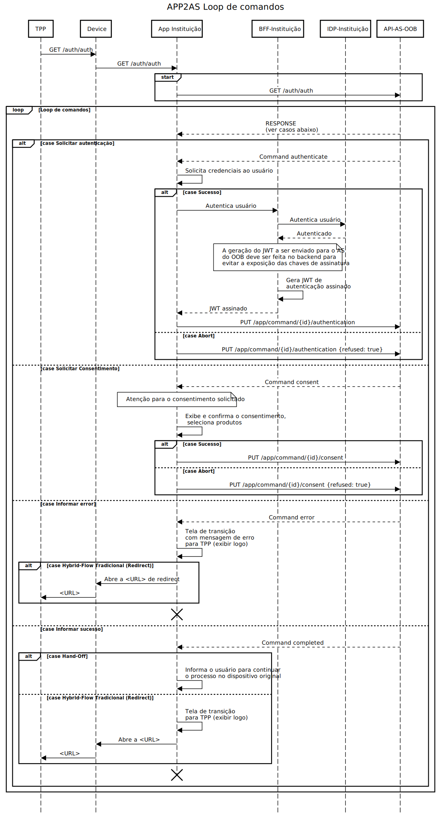

# Aplicativo Mobile

A integração por aplicativo mobile para a geração do consentimento é a que proporciona a melhor experiência de uso para o cliente da instituição, pois permite que a jornada de consentimento e gestão de consentimentos sejam realizadas de maneira fluida e natural.

No contexto do *Open Finance Brasil*, o aplicativo mobile é acionado no momento em que o cliente vai efetivar um consentimento. Tipicamente, ele acionou em outra instituição financeira a opção de compartilhar seus dados com ela, e será necessário executar um fluxo de autorização em que o aplicativo mobile da outra instituição chamará o aplicativo mobile da instituição financeira transmissora (isto é, o *nosso* aplicativo mobile) para autenticar o consentimento.

De maneira análoga, quando o cliente autoriza um *iniciador de transação de pagamento* a enviar um  pedido de pagamento para a instituição financeira detentora de conta, será disparada uma jornada de consentimento que acionará o aplicativo mobile para realizar a autenticação que confirmará a transação.

## Deep Link e Universal Link

O aplicativo da instituição precisa interceptar as chamadas do receptor de dados (que está requisitando a criação de um consentimento de compartilhamento de dados) ou do iniciador de transação de  pegamentos e enviar ao Authorization Server quando essas ocorrem no celular do usuário, permitindo dessa forma realizar a geração do consentimento no aplicativo.

O aplicativo também pode ser acionado durante fluxo *hybrid flow* com *Handoff*, onde o usuário está criando o consentimento em  um computador via Web e a instituição só possui autenticação através do seu aplicativo mobile. Nesse cenário o Authorization Server
(AS) da **Plataforma Opus Open Finance** exibirá um QR-code com uma URL que também deve ser interceptada pelo aplicativo. Utilizar uma URL interceptável pelo aplicativo permite ao usuário, inclusive, realizar a leitura do QR-code através de qualquer aplicativo além do próprio da instituição.

Desta forma, temos dois padrões de URLs que precisam ser interceptados pelo aplicativo da instituição, como vemos na tabela abaixo:

| Origem                      | URL                                                    |
| ----------------------------| ------------------------------------------------------ |
| Mesmo dispositivo           | `https://<EV-FQDN-open-banking>/auth/auth`             |
| Outro dispositivo (*HandOff*) | `https://<EV-FQDN-open-banking>/auth/handoff/{id}`     |

### O que fazer ao interceptar uma URL?

Uma vez que a aplicação está interceptando as URLs e sendo acionada durante uma solicitação de consentimento, o próximo passo é realizar todo tratamento da geração do consentimento de fato.

De posse de uma URL interceptada, o primeiro passo é realizar o *request* `GET` de fato na URL acionada, incluindo todos os parâmetros de *query-string* que possam existir e adicionado o header `Accept` com o valor `application/json`. Esse header informa ao Authorization Server que a chamada está sendo realizada pelo aplicativo e não pelo navegador.

O Authorization Server, sabendo que a chamada foi realizada pelo aplicativo, passará a funcionar como uma API REST, respondendo aos *requests* sempre no formato JSON. A adição do header é obrigatória em todas as chamadas entre o aplicativo da instituição e o Authorization Server do Opus Open Finance.

A resposta do `GET` inicial é o primeiro de uma série de comandos que o aplicativo deve executar durante um loop de eventos vindos do Authorization Server. A definição deste loop de eventos será detalhada no momento de iniciar o projeto de integração do aplicativo móvel com a plataforma da Opus.

## Diagrama de sequência

O diagrama de sequência a seguir ilustra de forma resumida o funcionamento da interação entre o aplicativo mobile da instituição e o Authorization Server.

## Open API Specification

As definições da API REST disponibilizado pelo Authorization Server para o aplicativo móvel podem ser consultadas [aqui][API-Mobile]

## Mock para integração

Para auxiliar no desenvolvimento da integração está disponível um *mock* na
ferramenta [Mockoon](https://mockoon.com/) e definido nesse [arquivo JSON](./mockoon.json).

Vários cenários estão mockados e são acionados através das respectivas URLs iniciais:

| Cenário                                                                   | URL para iniciar processo                              |
| ------------------------------------------------------------------------- | ------------------------------------------------------ |
| Hybrid-flow / Pagamento                                                   | <http://localhost:3301/auth/auth?id=standard>          |
| Hybrid-flow hand-off / Pagamento                                          | <http://localhost:3301/auth/app/commands/handoff>      |
| Hybrid-flow / CPF_MISMATCH na autenticação                                | <http://localhost:3301/auth/auth?id=cpf>               |
| Hybrid-flow / EXPIRED_CONSENT no link inicial                             | <http://localhost:3301/auth/auth?id=expired>           |
| Hybrid-flow / RESOURCE_MUST_CONTAIN_ID na confirmação                     | <http://localhost:3301/auth/auth?id=resource>          |
| Hybrid-flow / RESOURCE_MUST_CONTAIN_ID_SELECTABLE_PRODUCTS na confirmação | <http://localhost:3301/auth/auth?id=resource>          |
| Hybrid-flow / DISCOVERY_ERROR na autenticação                             | <http://localhost:3301/auth/auth?id=discovery>         |
| Hybrid-flow / DISCOVERY_TIMEOUT na autenticação                           | <http://localhost:3301/auth/auth?id=discovery-timeout> |
| Hybrid-flow / INVALID_STATUS_CONFIRMATION na confirmação                  | <http://localhost:3301/auth/auth?id=resource>          |
| Hybrid-flow / GENERIC_ERROR no link inicial                               | <http://localhost:3301/auth/auth?id=generic>           |

Para executar o mock basta importar o JSON na ferramenta *Mockoon* e iniciar o servidor do *environment* "Opus Open Finance Authorization Server Apps API".

[API-Mobile]: ../../../../../../../swagger-ui/index.html?api=Mobile
