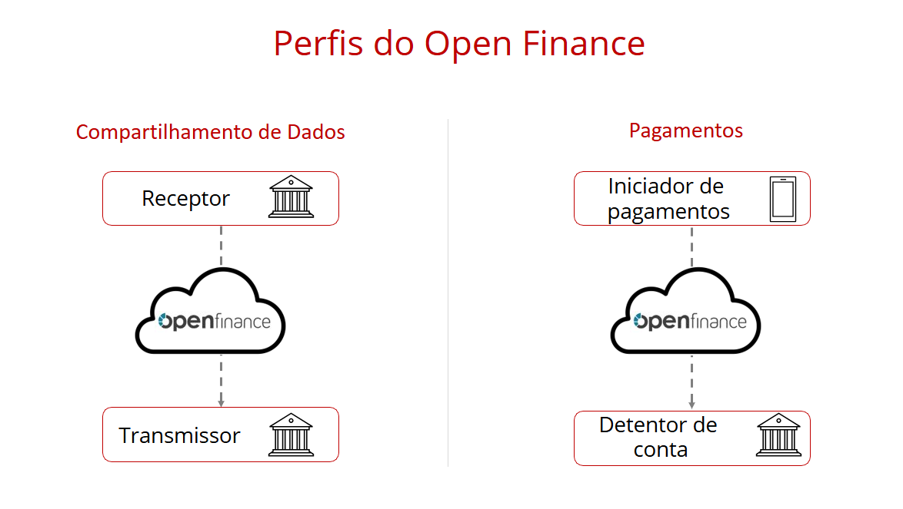

# Perfis de Atuação

## Introdução

O Open Finance conta com diferentes perfis de atuação. Para toda interação no ecossistema, é necessária uma entidade ativa, que inicia uma nova jornada do Open Finance, e uma entidade passiva, que recebe a solicitação para essa jornada.

Atualmente, existem **2 entidades ativas** e **2 passivas**:

### No ecossistema de Dados:
- **Transmissora de Dados** - Parte passiva.
- **Receptora de Dados** - Parte ativa.

### No ecossistema de Pagamentos:
- **Detentora de Conta** - Parte passiva.
- **Iniciadora de Transação de Pagamento (ITP)** - Parte ativa.

**Nota**: Apenas o perfil de **Detentor de Conta** é regulatório. Os demais perfis são opcionais para as instituições participantes, exceto para bancos classificados como S1 e S2, que são obrigados a participar do ecossistema de dados.

---

## Nomenclatura TPP

O termo **TPP** é utilizado para representar ambas as partes ativas do ecossistema, ou seja:
- **Receptor de Dados**
- **ITP**

---

## Perfis de Participação no Open Finance

Os perfis de atuação podem ser entendidos conforme a tabela abaixo:

| **Ecossistema** | **Client (TPP - parte ativa)** | **Server (parte passiva)** |
|------------------|--------------------------------|-----------------------------|
| **Dados**        | Receptor de Dados             | Transmissor de Dados        |
| **Pagamentos**   | ITP                           | Detentor de Conta           |

---

## Soluções da Opus

A Opus oferece uma solução completa para atender a todos os requisitos necessários para uma instituição se tornar participante de qualquer perfil do Open Finance.